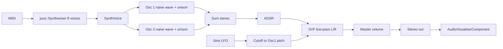

# Cortexia — progress notes

Snapshot of the codebase as of 8 September 2026. This is a status log, not a design spec for the finished product.

**End goal:** a synth VST that mixes **Serum 2** (wavetable / visual osc workflow, modulation, FX) and **Harmor** (additive / harmonic control, image-like spectral editing).

**Where we are:** a playable **virtual analog** instrument with two classic oscillators, unison, a low-pass filter, one LFO, ADSR, and a dark modular GUI. Nothing wavetable, additive, or AI yet.

---

## Project identity

| | |
|---|---|
| Product | Cortexia |
| Tagline in UI | VIRTUAL ANALOG |
| Company | Haramonics |
| Manufacturer code | `Aico` |
| Plugin codes | `Co01` (synth), `CoFX` (effect target) |
| Framework | JUCE 8.0.0 (fetched via CMake `FetchContent`) |
| Formats | Cortexia: VST3, AU, Standalone. CortexiaFX: VST3, AU |

Build is defined in [`CMakeLists.txt`](CMakeLists.txt). Both targets compile the **same** source files. CortexiaFX is labeled as an effect (`IS_SYNTH FALSE`) but still runs the synth processor/editor — there is no separate FX DSP yet.

Existing one-line vision in [`README.md`](README.md): Serum-like, plus possible AI for sounds, presets, wavetables, and effects. That is still future work.

---

## Source layout

```
Source/
  Core/     PluginProcessor, PluginEditor
  DSP/      Oscillator, SynthVoice, LFO, StateVariableFilter
  GUI/      ModernLookAndFeel, WaveformDisplay
```

| File | Role |
|---|---|
| [`Source/Core/PluginProcessor.h`](Source/Core/PluginProcessor.h) / [`.cpp`](Source/Core/PluginProcessor.cpp) | APVTS parameters, 8-voice `juce::Synthesiser`, `processBlock`, state XML, visualizer pointer |
| [`Source/Core/PluginEditor.h`](Source/Core/PluginEditor.h) / [`.cpp`](Source/Core/PluginEditor.cpp) | 1000×650 UI, knobs, waveform drawings, oscilloscope |
| [`Source/DSP/SynthVoice.h`](Source/DSP/SynthVoice.h) / [`.cpp`](Source/DSP/SynthVoice.cpp) | Live voice: osc 1+2, ADSR, stereo SVF, LFO routing |
| [`Source/DSP/Oscillator.h`](Source/DSP/Oscillator.h) / [`.cpp`](Source/DSP/Oscillator.cpp) | Standalone osc class (compiled, **not used** by the voice) |
| [`Source/DSP/LFO.h`](Source/DSP/LFO.h) / [`.cpp`](Source/DSP/LFO.cpp) | Sine LFO |
| [`Source/DSP/StateVariableFilter.h`](Source/DSP/StateVariableFilter.h) / [`.cpp`](Source/DSP/StateVariableFilter.cpp) | TPT SVF, low-pass only |
| [`Source/GUI/ModernLookAndFeel.h`](Source/GUI/ModernLookAndFeel.h) / [`.cpp`](Source/GUI/ModernLookAndFeel.cpp) | Rotary knobs, combo/popup colours |
| [`Source/GUI/WaveformDisplay.h`](Source/GUI/WaveformDisplay.h) / [`.cpp`](Source/GUI/WaveformDisplay.cpp) | Waveform component (compiled, **not used** by the editor) |

Old flat files (`Source/PluginProcessor.*`, `Source/pluginEditor.h`) were moved into `Source/Core/` and `Source/DSP/` / `Source/GUI/`.

---

## Audio architecture



1. Processor reads APVTS once per block and pushes values into every `SynthVoice`.
2. Each voice renders sample-by-sample: unison oscillators → velocity × ADSR × master → stereo LP filter.
3. LFO is per-voice sine. Target `None` (0), `Cutoff` (1), or `Pitch 1` (2). Cutoff modulation is `baseCutoff * (1 + lfo * depth)`. Pitch 1 adds up to ±12 semitones at full depth.
4. Mixer-down of L/R is pushed to the editor oscilloscope if the editor is open (`std::atomic` pointer; cleared in the editor destructor).

Polyphony: **8** voices. One `SynthSound` accepts all notes/channels.

Pitch wheel and MIDI CCs are stubbed (empty).

---

## Oscillators and unison (live path)

Implemented **inside** `SynthVoice::renderNextBlock`, not via the `Oscillator` class.

- Shapes: Sine, Saw, Square, Triangle (`WaveType`). Naive math, **no band-limiting / BLEP**.
- Tune: ±24 semitones (integer steps). Detune: ±50 cents.
- Unison: 1–7 voices. Voice 0 is centre; others are paired left/right with pan spread and extra detune (`unisonDetune * 50` cents scale). Blend scales side voices by `blend / sqrt(N-1)`.
- Osc 2 defaults to volume **0** (silent until raised). Osc 1 defaults to saw, volume 0.5.

Note-on randomizes 7 phases per oscillator and resets both filters.

---

## Filter, LFO, envelope

**Filter** — trapezoidal SVF (`g = tan(π fc / sr)`, `k = 1/Q`). Only `processLowPass` is used. Cutoff 20–20000 Hz (skewed range), Q 0.707–10. Per-sample `setParams` on both channels.

**LFO** — phase accumulator, `sin`. Rate 0.1–20 Hz. Depth 0–1. Free-running (not tempo-synced, not retriggered on note-on).

**Envelope** — JUCE ADSR. Attack/decay 0.01–3 s, sustain 0–1, release 0.01–5 s. Voice clears when ADSR goes inactive.

---

## Parameters (APVTS)

State is XML via `getStateInformation` / `setStateInformation`. Hosts can save/recall; there is **no in-plugin preset browser**.

| ID | UI | Default |
|---|---|---|
| `MASTER_VOL` | Master | 0.80 |
| `OSC` | Osc 1 waveform | Sawtooth |
| `VOLUME` | Osc 1 Vol | 0.50 |
| `TUNE1` / `DETUNE1` | Tune / Detune | 0 |
| `UNISON1` | Voices | 1 |
| `UDETUNE1` / `UBLEND1` | U.Detune / U.Blend | 0.20 / 0.75 |
| `OSC2` | Osc 2 waveform | Sine |
| `VOL2` | Osc 2 Vol | 0.00 |
| `TUNE2` / `DETUNE2` | Tune / Detune | 0 |
| `UNISON2` | Voices | 1 |
| `UDETUNE2` / `UBLEND2` | U.Detune / U.Blend | 0.20 / 0.75 |
| `CUTOFF` | Cutoff | 20000 |
| `RESONANCE` | Resonance | 0.707 |
| `LFO_RATE` / `LFO_DEPTH` / `LFO_TARGET` | Rate / Depth / Target | 2.0 / 0.00 / Cutoff |
| `ATTACK` / `DECAY` / `SUSTAIN` / `RELEASE` | ADSR | 0.10 / 0.10 / 0.80 / 0.40 |

---

## GUI (current look)

Editor size: **1000 × 650**. Dark vertical gradient (`#121418` → `#090a0c`). Rounded panels with drop shadow, 1.5 px border, coloured accent bar on top.

| Panel | Accent | Contents |
|---|---|---|
| Header | — | **CORTEXIA** + *VIRTUAL ANALOG* |
| Oscilloscope | rose waveform on near-black | Thin bar ~582,22 286×41; 30 fps, buffer 256 |
| Master | rose `#f43f5e` | Large rotary, default 0.80 |
| Oscillator 1 | cyan `#38bdf8` | Wave preview + combo overlay; Vol, Tune, Detune, Voices; U.Blend beside the wave, U.Detune in the knob row |
| Oscillator 2 | same cyan | Same layout; Sine, Vol 0.00 |
| Filter | orange `#fb923c` | Large Cutoff, Resonance below |
| Modulation | purple `#c084fc` | Target combo (None / Cutoff / Pitch 1), Rate, Depth |
| Envelope | green `#4ade80` | Attack, Decay, Sustain, Release — tall knobs in the right column |

Wave previews are **painted** (`drawWaveformPath`) over dark rounded “screens”; a transparent `ComboBox` sits on top for selection. Changing the combo `repaint()`s the path.

Knobs: `ModernLookAndFeel` — grey track arc, coloured value arc from `rotarySliderFillColourId`, dark disc, light pointer. Text boxes below, no outline.

Host/standalone chrome may show a **Presets** menu; that is not implemented in the editor.

---

## Unused / duplicated code

- **`Oscillator`**: same wave + unison math as `SynthVoice`. Voice still has its own `phase1[7]` / `phase2[7]` loops. Wiring the class in would remove duplication.
- **`WaveformDisplay`**: independent component with similar path drawing. Editor does not instantiate it.

Both are listed in `target_sources` for Cortexia and CortexiaFX.

---

## Gap vs Serum 2 + Harmor

| Area | Now | Not yet |
|---|---|---|
| Oscillators | 2× analog shapes | Wavetables, WT position, extra oscs, noise, sub, Harmor partials |
| Unison | Analog spread 1–7 | Serum-style unison / warp / unison as WT feature |
| Filter | LP SVF only | HP/BP/notch, types, drive, envelope amount dedicated to filter |
| Modulation | 1 sine LFO, 2 targets | Matrix, macros, multi-LFO/env, per-harmonic envelopes |
| FX | None | Distortion, delay, reverb, chorus, compressor, etc. |
| Visuals | Static wave icons + thin scope | WT 3D/2D, FFT, additive bars, image-to-partials |
| Presets | Host state only | Browser, init, morph |
| AI | README mention only | Generate WT / presets / FX |
| CortexiaFX | Same binary sources as synth | Real mixer/effect plugin |

---

## What this milestone is

A **VA prototype**: MIDI in, two mixable oscillators with unison, LP filter, one LFO, ADSR, master, themed UI, and host automation/state. Solid base to grow toward wavetable (Serum 2) and additive/harmonic (Harmor) engines without throwing away the voice, parameter, and panel structure.
