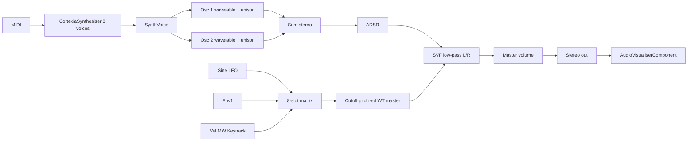

# Cortexia — progress notes

Snapshot of the codebase as of 12 September 2026. This is a status log, not a design spec for the finished product.

**End goal:** a synth VST that mixes **Serum 2** (wavetable / visual osc workflow, modulation, FX) and **Harmor** (additive / harmonic control, image-like spectral editing).

**Where we are:** a playable **wavetable VA** instrument: two osc slots read Fourier-generated analog tables (mipmaps + 2x cubic lookup), unison, a low-pass filter, one LFO, ADSR, WT position (1 frame for now), and a dark modular GUI. No multi-frame import, Harmor additive, or AI yet.

---

## Project identity

| | |
|---|---|
| Product | Cortexia |
| Tagline in UI | VIRTUAL ANALOG |
| Company | Haramonics |
| Manufacturer code | `Aico` |
| Plugin codes | `Co01` (synth), `CoFX` (effect target) |
| Framework | JUCE 8.0.0 (fetched via CMake `FetchContent`) |
| Formats | Cortexia: VST3, AU, Standalone. CortexiaFX: VST3, AU |

Build is defined in [`CMakeLists.txt`](CMakeLists.txt). Both targets compile the **same** source files. CortexiaFX is labeled as an effect (`IS_SYNTH FALSE`) but still runs the synth processor/editor — there is no separate FX DSP yet.

Existing one-line vision in [`README.md`](README.md): Serum-like, plus possible AI for sounds, presets, wavetables, and effects. That is still future work.

---

## Source layout

```
Source/
  Core/     PluginProcessor, PluginEditor
  DSP/      Wavetable, Oscillator, SynthVoice, CortexiaSynth, ModMatrix, LFO, StateVariableFilter
  GUI/      ModernLookAndFeel, WaveformDisplay (plus filter/env/LFO graphs)
```

| File | Role |
|---|---|
| [`Source/Core/PluginProcessor.h`](Source/Core/PluginProcessor.h) / [`.cpp`](Source/Core/PluginProcessor.cpp) | APVTS parameters, 8-voice `CortexiaSynthesiser`, `processBlock`, state XML, visualizer pointer |
| [`Source/Core/PluginEditor.h`](Source/Core/PluginEditor.h) / [`.cpp`](Source/Core/PluginEditor.cpp) | 1280×720 UI, Osc/Matrix tabs, knobs, oscilloscope, voicing strip |
| [`Source/DSP/CortexiaSynth.h`](Source/DSP/CortexiaSynth.h) / [`.cpp`](Source/DSP/CortexiaSynth.cpp) | Poly vs mono/legato MIDI, note stack, porta/Always flags |
| [`Source/DSP/ModMatrix.h`](Source/DSP/ModMatrix.h) | 8-slot source/dest/amount/bipolar pack |
| [`Source/DSP/SynthVoice.h`](Source/DSP/SynthVoice.h) / [`.cpp`](Source/DSP/SynthVoice.cpp) | Live voice: two `Oscillator`s, ADSR, stereo SVF, matrix apply, porta glide |
| [`Source/DSP/Oscillator.h`](Source/DSP/Oscillator.h) / [`.cpp`](Source/DSP/Oscillator.cpp) | Live osc: unison + wavetable playback |
| [`Source/DSP/Wavetable.h`](Source/DSP/Wavetable.h) / [`.cpp`](Source/DSP/Wavetable.cpp) | 2048-sample frames, 8 mips, analog Fourier bank |
| [`Source/DSP/LFO.h`](Source/DSP/LFO.h) / [`.cpp`](Source/DSP/LFO.cpp) | Sine LFO |
| [`Source/DSP/StateVariableFilter.h`](Source/DSP/StateVariableFilter.h) / [`.cpp`](Source/DSP/StateVariableFilter.cpp) | TPT SVF, low-pass only |
| [`Source/GUI/ModernLookAndFeel.h`](Source/GUI/ModernLookAndFeel.h) / [`.cpp`](Source/GUI/ModernLookAndFeel.cpp) | Rotary knobs, combo/popup colours |
| [`Source/GUI/WaveformDisplay.h`](Source/GUI/WaveformDisplay.h) / [`.cpp`](Source/GUI/WaveformDisplay.cpp) | Waveform component (compiled, **not used** by the editor) |

Old flat files (`Source/PluginProcessor.*`, `Source/pluginEditor.h`) were moved into `Source/Core/` and `Source/DSP/` / `Source/GUI/`.

---

## Audio architecture



1. Processor reads APVTS once per block and pushes values into every `SynthVoice`.
2. Each voice renders sample-by-sample: unison oscillators → velocity × ADSR × master → stereo LP filter.
3. LFO is per-voice sine. Depth 0–1 scales LFO1 as a matrix source. Eight matrix slots add to cutoff, osc pitch/vol/WT pos, and master. Cutoff: `base * (1 + contrib)`. Pitch: `contrib * 12` semitones. Amount 0 is silence on that slot.
4. Mixer-down of L/R is pushed to the editor oscilloscope if the editor is open (`std::atomic` pointer; cleared in the editor destructor).

Polyphony: **8** voices. Modes **Poly / Mono / Legato**, portamento 0–2 s, **Always** glide. One `SynthSound` accepts all notes/channels.

Pitch wheel and MIDI CCs: pitch bend is live (`BEND_RANGE` 0–24 st, default 2) on the gliding pitch. CC1 (mod wheel) and CC11 (expression) are stored 0–1. CC1 is a matrix source (**ModWheel**). On-screen **MW** knob writes the same CC1 value.

---

## Oscillators and unison (live path)

`SynthVoice` owns two `Oscillator` instances. Analog shapes are **generated wavetables** in `AnalogWavetableBank` (shared, built once at plugin load).

- Table: 2048 samples, 1 frame, 8 Fourier mips (Lanczos σ), peak-normalized to ~0.9
- Playback: mip pick from Hz, Catmull-Rom cubic, 2x oversampled lookup + 5-tap downsample
- `WTPOS1` / `WTPOS2` (`0..1`) morph between frames; with one frame this is a no-op hook for later multi-frame / Harmor fills
- Tune: ±24 semitones. Detune: ±50 cents. Unison 1–7 unchanged (centre + paired pan/detune, blend)
- Osc 2 defaults to volume **0**. Osc 1 defaults to saw, volume 0.5
- Osc1/Osc2 pitch, vol, and WT pos are matrix destinations

Note-on randomizes table phases and clears 2x history; filters reset.

---

## Filter, LFO, envelope

**Filter** — trapezoidal SVF (`g = tan(π fc / sr)`, `k = 1/Q`). Only `processLowPass` is used. Cutoff 20–20000 Hz (skewed range), Q 0.707–10. Per-sample `setParams` on both channels.

**LFO** — phase accumulator, `sin`. Rate 0.1–20 Hz. Depth 0–1. Free-running (not tempo-synced, not retriggered on note-on).

**Envelope** — JUCE ADSR. Attack/decay 0.01–3 s, sustain 0–1, release 0.01–5 s. Voice clears when ADSR goes inactive.

---

## Parameters (APVTS)

State is XML via `getStateInformation` / `setStateInformation`. Hosts can save/recall; there is **no in-plugin preset browser**.

| ID | UI | Default |
|---|---|---|
| `MASTER_VOL` | Master | 0.80 |
| `BEND_RANGE` | Bend (semitones) | 2 |
| `VOICE_MODE` | Poly / Mono / Legato | Poly |
| `PORTA` | Portamento (seconds) | 0 |
| `ALWAYS_GLIDE` | Always glide | off |
| `OSC` | Osc 1 waveform | Sawtooth |
| `VOLUME` | Osc 1 Vol | 0.50 |
| `TUNE1` / `DETUNE1` | Tune / Detune | 0 |
| `UNISON1` | Voices | 1 |
| `UDETUNE1` / `UBLEND1` / `WTPOS1` | U.Detune / U.Blend / WT Pos | 0.20 / 0.75 / 0.00 |
| `OSC2` | Osc 2 waveform | Sine |
| `VOL2` | Osc 2 Vol | 0.00 |
| `TUNE2` / `DETUNE2` | Tune / Detune | 0 |
| `UNISON2` | Voices | 1 |
| `UDETUNE2` / `UBLEND2` / `WTPOS2` | U.Detune / U.Blend / WT Pos | 0.20 / 0.75 / 0.00 |
| `CUTOFF` | Cutoff | 20000 |
| `RESONANCE` | Resonance | 0.707 |
| `LFO_RATE` / `LFO_DEPTH` | Rate / Depth | 2.0 / 0.00 |
| `LFO_TARGET` | unused (legacy XML) | Cutoff |
| `ATTACK` / `DECAY` / `SUSTAIN` / `RELEASE` | ADSR | 0.10 / 0.10 / 0.80 / 0.40 |
| `MTX1_SRC` / `_DST` / `_AMT` / `_BIP` | Slot 1 | LFO 1 / Cutoff / 0 / off |
| `MTX2`–`MTX8` `_*` | Slots 2–8 | None / None / 0 / off |

---

## GUI (current look)

Editor size: **1280 × 720**. Header tabs **OSC** | **MATRIX**. Mockup-inspired dark navy (`#0a0e14` → `#0d1218`), inset panels `#121820`, 1 px `#1c2430` borders, 8 px corners.

| Panel | Accent | Contents |
|---|---|---|
| Header | teal | **CORTEXIA**, **OSC** / **MATRIX** tabs, scope, **BEND** range, master |
| OSC A / OSC B | `#2ee6c8` / `#38bdf8` | Osc page: wavetable badge, shape combo, live table preview, 7 knobs |
| Filter | teal | Osc page: LP response curve, Cutoff + Res |
| Envelope | `#4ade80` | Osc page: ADSR graph + knobs |
| LFO | `#e879f9` | Osc page: sine graph, Rate, Depth |
| Matrix | teal | Matrix page: 8 rows (source, dest, amount, bipolar) |
| Keyboard | — | Both pages: voicing (MODE / PORTA / ALWAYS), keys (C1–C6), **MW** |

`WaveformDisplay` samples mip 0 of `AnalogWavetableBank`. Knobs: thin 2.5 px arcs, dark caps. Combos are dark pills (not overlaid on the wave).

Host/standalone chrome may show a **Presets** menu; that is not implemented in the editor.

---

## Unused / duplicated code

None of the GUI display classes are unused: `WaveformDisplay` is the osc preview; filter / ADSR / LFO graphs live in the same files.

`Oscillator` is the live osc path. Harmor should later fill `Wavetable` frames (then rebuild mips), not duplicate voice render loops.

---

## Gap vs Serum 2 + Harmor

| Area | Now | Not yet |
|---|---|---|
| Oscillators | 2× analog wavetables, WT pos (1 frame) | Multi-frame WT import, extra oscs, noise, sub, Harmor partials |
| Unison | Analog spread 1–7 | Serum-style unison / warp / unison as WT feature |
| Filter | LP SVF only | HP/BP/notch, types, drive, envelope amount dedicated to filter |
| Modulation | 8-slot matrix (LFO1, Env1, Vel, MW, Keytrack) | Macros, extra LFOs/envs, aftertouch |
| FX | None | Distortion, delay, reverb, chorus, compressor, etc. |
| Visuals | Table preview, filter/env/LFO graphs, keyboard, thin scope | WT 3D mesh, FFT, additive bars, image-to-partials |
| Presets | Host state only | Browser, init, morph |
| AI | README mention only | Generate WT / presets / FX |
| CortexiaFX | Same binary sources as synth | Real mixer/effect plugin |

---

## What this milestone is

A **wavetable VA** with an 8-slot modulation matrix: MIDI in, two mixable table oscs with unison, LP filter, one LFO, ADSR, master, themed UI, and host automation/state. Next: 2.2 aftertouch / leftover LFO_TARGET cleanup.
